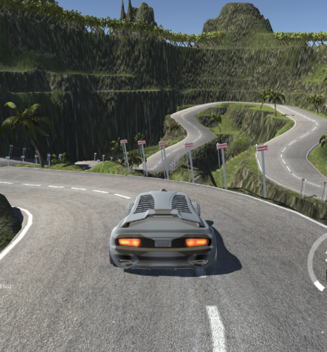

# Project : Use Deep Learning to Clone Driving Behavior

## Overview

The goals / steps of this project are the following:
* Use the simulator to collect data of good driving behavior 
* Design, train and validate a deep convolutional neural network model that predicts a steering angle from image data
* Use the model to drive the vehicle autonomously in the simulator with the vehicle remaining on the road throughout

More information about this project is provided in the [report](https://github.com/girishpai/CarND_BehavClone/blob/master/Writeup_report.pdf).

### Dependencies
This project requires:

* [CarND Term1 Starter Kit](https://github.com/udacity/CarND-Term1-Starter-Kit)

The enviroment can be created with Udacity CarND Term1 Starter Kit. Click [here](https://github.com/udacity/CarND-Term1-Starter-Kit/blob/master/README.md) for the details.

The simulator can be obtained from [here](https://github.com/udacity/self-driving-car-sim). 

